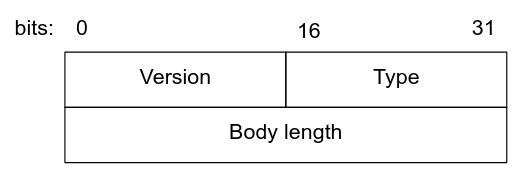
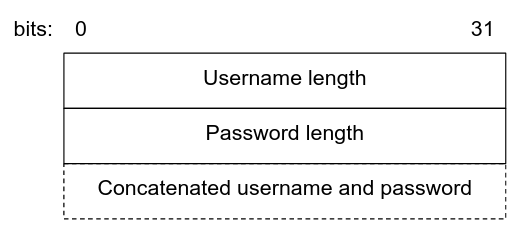
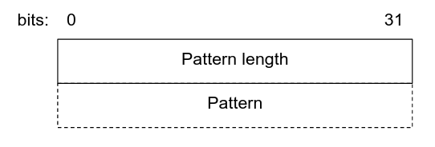
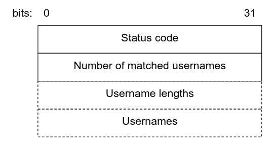
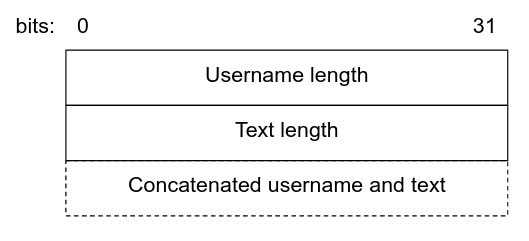
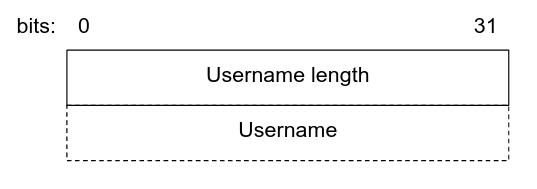
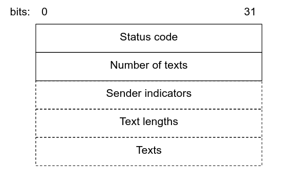
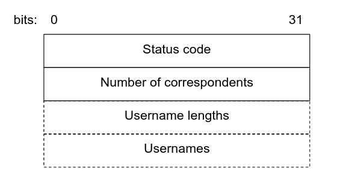
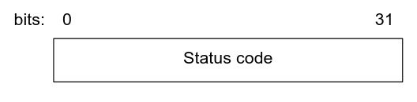
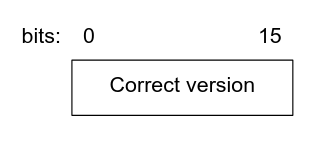

# Chat 262 Protocol

- [1. Introduction](#1-introduction)
- [2. Message Structure](#2-message-structure)
- [3. Message Types](#3-message-types)
  - [3.1. Registration Request](#31-registration-request)
  - [3.2. Registration Response](#32-registration-response)
  - [3.3. Login Request](#33-login-request)
  - [3.4. Login Response](#34-login-response)
  - [3.5. Logout Request](#35-logout-request)
  - [3.6. Logout Response](#36-logout-response)
  - [3.7. Search Accounts Request](#37-search-accounts-request)
  - [3.8. Search Accounts Response](#38-search-accounts-response)
  - [3.9. Send Text Request](#39-send-text-request)
  - [3.10. Send Text Response](#310-send-text-response)
  - [3.11. Receive Text Request](#311-receive-text-request)
  - [3.12. Receive Text Response](#312-receive-text-response)
  - [3.13. Retrieve Correspondents Request](#313-retrieve-correspondents-request)
  - [3.14. Retrieve Correspondents Response](#314-retrieve-correspondents-response)
  - [3.15. Delete Account Request](#315-delete-account-request)
  - [3.16. Delete Account Response](#316-delete-account-response)
  - [3.17. Wrong Version Response](#317-wrong-version-response)
  - [3.18. Invalid Type Response](#318-invalid-type-response)
- [4. Status Codes](#4-status-codes)

## 1. Introduction

Chat 262 protocol is request/response protocol that orchestrates communication between a client and a server. The protocol is layered atop TCP/IP.

The server listens on a TCP socket, on TCP port 61079. (This port is in the range reserved for dynamic, private, and ephemeral ports. See [here](https://en.wikipedia.org/wiki/List_of_TCP_and_UDP_port_numbers#Dynamic,_private_or_ephemeral_ports).)

The client connects to the server. Once the server accepts the connection, it maintains a stateful connection with the client.

Communication is done in *communication rounds*. The client initiates a communication round by sending a request to the server. The server processes the request, and sends a response back to the client. After this, the communication round is finished and the server waits for another request that will initiate the next round of communication.

Each communication round consists of a pair of *messages*, one of which is a *request* sent from the client to the server, and the other is a *response* sent from the server to the client.

## 2. Message Structure

Each message passed between a server and a client consists of two parts:

- A message header
- A message body

The message header always has the same structure, regardless of whether the message is a request or a response. This structure is depicted as follows:

Each field of the message header should be interpreted in **little-endian byte order**.

Bits 0–15 of the header represent the version of the Chat 262 protocol. In the current specification, this is always set to 1.

Bits 16–31 of the header represent the message type. The current specification defines the following values for this field:

- [Registration request message](#31-registration-request) — type 101
- [Registration response message](#32-registration-response) — type 201
- [Login request message](#33-login-request) — type 102
- [Login response message](#34-login-response) — type 202
- [Logout request message](#35-logout-request) — type 103
- [Logout response message](#36-logout-response) — type 203
- [Search accounts request message](#37-search-accounts-request) — type 104
- [Search accounts response message](#38-search-accounts-response) — type 204
- [Send text request message](#39-send-text-request) — type 105
- [Send text response message](#310-send-text-response) — type 205
- [Receive text request message](#311-receive-text-request) — type 106
- [Receive text response message](#312-receive-text-response) — type 206
- [Retrieve correspondents request message](#313-retrieve-correspondents-request) — type 107
- [Retrieve correspondents response message](#314-retrieve-correspondents-response) — type 207
- [Delete account request message](#315-delete-account-request) — type 108
- [Delete account response message](#316-delete-account-response) — type 208
- [Wrong version response message](#317-wrong-version-response) — type 301
- [Invalid type response message](#318-invalid-type-response) — type 302

Bits 32–63 of the header represent the length of the message body in bytes. Each of the message types listed above has the correspondingly defined message body.

The message body is directly attached to the message header. The structure of the message body depends on the message type.

## 3. Message Types

This section describes the message types defined by this specification.

In general, message types, as stored in the message header ([Section 2](#2-message-structure)), are located in the following ranges:

- 101–199. This range is reserved for client requests.
- 201–299. This range is reserved for server responses.
- 301–399. This range is reserved for special server responses, when a normal response cannot be sent.

### 3.1. Registration Request

The registration request registers a new user with the Chat 262 service.

The type of this message is **<u>101</u>**.

The body of this message is structured as follows:

Each field of the registration request should be interpreted in **little-endian byte order**.

Bits 0–31 represent the length of the username in bytes.

Bits 32–63 represent the length of the password in bytes.

Bits starting with bit 64 represent the username and the password, concatenated. The username is stored starting from bit 64, up to the length of the username. The password is stored immediately afterwards, up to the length of the password.

The body length in the message header should be set to total length in bytes of the structure described above.

### 3.2. Registration Response

The registration response is sent after receiving a registration request from the client.

The type of this message is **<u>201</u>**.

The body of this message is structured as follows:

Each field of the registration response should be interpreted in **little-endian byte order**.

Bits 0–31 represent the status code ([Section 4](#4-status-codes)). The server may send the following status codes in the registration response:

- `OK`. The user was successfully registered with the Chat 262 service.
- `Invalid username`. The username was not 4–40 characters in length, or contained a whitespace or an asterisk.
- `Invalid password`. The password was not 4–60 characters in length.
- `Username already exists`. Another user was previously registered with the same username.

The body length in the message header should be set to total length in bytes of the structure described above.

### 3.3. Login Request

The login request attempts to log in an existing user to the Chat 262 service.

The type of this message is **<u>102</u>**.

The body of this message is structured as follows:

Each field of the login request should be interpreted in **little-endian byte order**.

Bits 0–31 represent the length of the username in bytes.

Bits 32–63 represent the length of the password in bytes.

Bits starting with bit 64 represent the username and the password, concatenated. The username is stored starting from bit 64, up to the length of the username. The password is stored immediately afterwards, up to the length of the password.

The body length in the message header should be set to total length in bytes of the structure described above.

### 3.4. Login Response

The login response is sent after receiving a login request from the client.

The type of this message is **<u>202</u>**.

The body of this message is structured as follows:

Each field of the login response should be interpreted in **little-endian byte order**.

Bits 0–31 represent the status code ([Section 4](#4-status-codes)). The server may send the following status codes in the login response:

- `OK`. The user was successfully logged in to the Chat 262 service. The TCP connection is now associated with the logged in user, and the server maintains this state.
- `Invalid credentials`. The combination of the username and the password do not correspond to an existing user.

The body length in the message header should be set to total length in bytes of the structure described above.

**NOTE**: If the TCP connection had previously been associated with a user, that user will first be logged out, before the current user is logged in. The server does not notify the client about this.

### 3.5. Logout Request

The logout request attempts to log out the currently logged in user from the Chat 262 service.

The type of this message is **<u>103</u>**.

The body of this message is **empty**. The body length in the header should be 0 bytes.

### 3.6. Logout Response

The logout response is sent after receiving a logout request from the client.

The type of this message is **<u>203</u>**.

The body of this message is structured as follows:

Each field of the logout response should be interpreted in **little-endian byte order**.

Bits 0–31 represent the status code ([Section 4](#4-status-codes)). The server may send the following status codes in the logout response:

- `OK`. The user was successfully logged out from the Chat 262 service. The TCP connection is no longer associated with any user, but is still active.
- `Unauthorized`. No user was logged in (i.e. the TCP conection was associated with no user).

The body length in the message header should be set to total length in bytes of the structure described above.

### 3.7. Search Accounts Request

The search accounts request attempts to retrieve a list of usernames currently registered with the Chat 262 service that match the specified pattern.

The type of this message is **<u>104</u>**.

The body of this message is structured as follows:

Each field of the search accounts request should be interpreted in **little-endian byte order**.

Bits 0–31 represent the length of the pattern in bytes.

Bits starting with bit 32 represent the pattern. The pattern is stored starting from bit 32, up to the length of the pattern.

The body length in the message header should be set to total length in bytes of the structure described above.

**NOTE**: The only special character in the pattern is the asterisk (`*`). This character will match zero or more of any character. As an example `C*2` will match `Chat262`, but not `Phat262`.

### 3.8. Search Accounts Response

The search accounts response is sent after receiving a search accounts request from the client.

The type of this message is **<u>204</u>**.

The body of this message is structured as follows:

Each field of the search accounts response should be interpreted in **little-endian byte order**.

Bits 0–31 represent the status code ([Section 4](#4-status-codes)). The server may send the following status codes in the search accounts response:

- `OK`. The matched usernames were successfully returned in the response (there may be none).
- `Unauthorized`. No user was logged in (i.e. the TCP conection was associated with no user). **No other fields exist in the response in this case**. The body length in the message header must reflect this.

Bits 32–63 represent the number of usernames that were matched. This field exists only if the status code is `OK`.

Bits starting with bit 64 represent the array of username lengths, each of which is 32 bits (4 bytes) long. This array exists only if the status code is `OK`. If there are `N` usernames, this array is located from bit 64, through bit `64 + (32 * N) - 1`.

Bits starting with bit `64 + (32 * N)` represent the array of usernames. This array exists only if the status code is `OK`. The first username is stored starting from bit `64 + (32 * N)`, up to the length of the username, which is described by the first member of the array of username lengths. In general, `i`-th username length is represented by the `i`-th member of the array of username lengths.

The body length in the message header should be set to total length in bytes of the structure described above.

### 3.9. Send Text Request

The send text request attempts to send the text (in a chatting context) to the specified user.

The type of this message is **<u>105</u>**.

The body of this message is structured as follows:

Each field of the send text request should be interpreted in **little-endian byte order**.

Bits 0–31 represent the length of the recipient's username in bytes.

Bits starting with bit 64 represent the recipient's username and the text, concatenated. The username is stored starting from bit 64, up to the length of the username. The text is stored immediately afterwards, up to the length of the text.

The body length in the message header should be set to total length in bytes of the structure described above.

### 3.10. Send Text Response

The send text response is sent after receiving a send text request from the client.

The type of this message is **<u>205</u>**.

The body of this message is structured as follows:

Each field of the logout response should be interpreted in **little-endian byte order**.

Bits 0–31 represent the status code ([Section 4](#4-status-codes)). The server may send the following status codes in the send text response:

- `OK`. The text was successfully send to the intended recipient. Note that this does not mean that the text was delivered to the recipient. Instead, this means that the server internally stored the text and the recipient in a database, and that the text will be delivered when the recipient requests it.
- `Unauthorized`. No user was logged in (i.e. the TCP conection was associated with no user).
- `User does not exist`. There is no user registered with the Chat 262 service with the specified username.

The body length in the message header should be set to total length in bytes of the structure described above.

### 3.11. Receive Text Request

The receive text request attempts to retrieve all previous texts that were exchanged with the specified correspondent.

The type of this message is **<u>106</u>**.

The body of this message is structured as follows:

Each field of the receive text request should be interpreted in **little-endian byte order**.

Bits 0–31 represent the length of the correspondent's username in bytes.

Bits starting with bit 32 represent the correspondent's username. The username is stored starting from bit 32, up to the length of the username.

The body length in the message header should be set to total length in bytes of the structure described above.

### 3.12. Receive Text Response

The receive text response is sent after receiving a receive text request from the client.

The type of this message is **<u>206</u>**.

The body of this message is structured as follows:

Each field of the receive text response should be interpreted in **little-endian byte order**.

Bits 0–31 represent the status code ([Section 4](#4-status-codes)). The server may send the following status codes in the receive text response:

- `OK`. All previous texts with the specified correspondent were successfully returned in the response (there may be none).
- `Unauthorized`. No user was logged in (i.e. the TCP conection was associated with no user). **No other fields exist in the response in this case**. The body length in the message header must reflect this.
- `User does not exist`. There is no user registered with the Chat 262 service with the specified username. **No other fields exist in the response in this case**. The body length in the message header must reflect this.

Bits 32–63 represent the number of texts that were received. This field exists only if the status code is `OK`.

Bits starting with bit 64 represent the array of sender indicators, each of which is 8 bits (1 byte) long. This array exists only if the status code is `OK`. If the sender indicator is equal to `1`, the sender of the corresponding text is the user who received the texts. If the sender indicator is equal to `0`, the sender of the corresponding text is the correspondent. No other values are valid in these fields. If there are `N` texts, this array is located from bit 64, through bit `64 + (8 * N) - 1`.

Bits starting with bit `64 + (8 * N)` represent the array of text lengths, each of which is 32 bits (4 bytes) long. This array exists only if the status code is `OK`. If there are `N` texts, this array is located from bit `64 + (8 * N)`, through bit `64 + (8 * N) + (32 * N) - 1`.

The first text is stored starting from bit `64 + (8 * N) + (32 * N)`, up to the length of the text, which is described by the first member of the array of text lengths. The sender of the text is described by the first member of the array of sender indicators. In general, `i`-th text length is represented by the `i`-th member of the array of text lengths, and the sender of `i`-th text is described by the `i`-th member of the array of sender indicators.

The body length in the message header should be set to total length in bytes of the structure described above.

### 3.13. Retrieve Correspondents Request

The retrieve correspondents request attempts to retrieve all usernames with whom the currently logged in user has exchanged a nonzero number of texts.

The type of this message is **<u>107</u>**.

The body of this message is **empty**. The body length in the header should be 0 bytes.

### 3.14. Retrieve Correspondents Response

The retrieve correspondents response is sent after receiving a retrieve correspondents request from the client.

The type of this message is **<u>207</u>**.

The body of this message is structured as follows:

Each field of the retrieve correspondents response should be interpreted in **little-endian byte order**.

Bits 0–31 represent the status code ([Section 4](#4-status-codes)). The server may send the following status codes in the retrieve correspondents response:

- `OK`. The correspondent usernames were successfully returned in the response (there may be none).
- `Unauthorized`. No user was logged in (i.e. the TCP conection was associated with no user). **No other fields exist in the response in this case**. The body length in the message header must reflect this.

Bits 32–63 represent the number of correspondents that were returned. This field exists only if the status code is `OK`.

Bits starting with bit 64 represent the array of correspondents' username lengths, each of which is 32 bits (4 bytes) long. This array exists only if the status code is `OK`. If there are `N` correspondents, this array is located from bit 64, through bit `64 + (32 * N) - 1`.

Bits starting with bit `64 + (32 * N)` represent the array of correspondents' usernames. This array exists only if the status code is `OK`. The first username is stored starting from bit `64 + (32 * N)`, up to the length of the username, which is described by the first member of the array of username lengths. In general, `i`-th username length is represented by the `i`-th member of the array of username lengths.

The body length in the message header should be set to total length in bytes of the structure described above.

### 3.15. Delete Account Request

The delete account request attempts to delete the currently logged in user's account.

The type of this message is **<u>108</u>**.

The body of this message is **empty**. The body length in the header should be 0 bytes.

### 3.16. Delete Account Response

The delete account response is sent after receiving a delete account request from the client.

The type of this message is **<u>208</u>**.

The body of this message is structured as follows:

Each field of the delete account response should be interpreted in **little-endian byte order**.

Bits 0–31 represent the status code ([Section 4](#4-status-codes)). The server may send the following status codes in the delete account response:

- `OK`. The user's account was successfully deleted from the Chat262 service. The texts associated with the current user are also deleted, and the user's correspondents can no longer retrieve them. The TCP connection is no longer associated with any user, but is still active.
- `Unauthorized`. No user was logged in (i.e. the TCP conection was associated with no user).

The body length in the message header should be set to total length in bytes of the structure described above.

### 3.17. Wrong Version Response

The wrong version response is a special response sent after the server detects an unsupported version in a client's request.

The type of this message is **<u>301</u>**.

The body of this message is structured as follows:

Each field of the wrong version response should be interpreted in **little-endian byte order**.

Bits 0–15 represent the version of the Chat 262 protocol used by the server. In the current specification, this version is always 1. The server may send the following status codes in the delete account response:

After sending the wrong version response, the server terminates the TCP connection with the client. The rationale for this is that the server cannot interpret any further messages sent by the client because of the unmatched protocol version. If the client wishes to resume communication, it should reconnect to the server and user the correct protocol version specified in the wrong version response.

The body length in the message header should be set to total length in bytes of the structure described above.

### 3.18. Invalid Type Response

The invalid type response is a special response sent after the server detects a message type that it does not know how to handle in a client's request.

The type of this message is **<u>302</u>**.

The body of this message is **empty**. The body length in the header should be 0 bytes.

After sending the wrong version response, the server will maintain the TCP connection with the client and wait for another request.

## 4. Status Codes

Almost all server responses (except special responses) include a status code. The current specification defines the following status codes, along with their values:

- `OK` — status code 0. Indicates that the request was processed as intended.
- `Invalid credentials` — status code 1. Indicates that the login request failed because the supplied credentials did not match any user registered with the Chat 262 service.
- `Username already exists` — status code 2. Indicated that the registration request failed because the supplied username already matches a registered user.
- `User does not exist` — status code 3. Indicates that the receive text request or send text request failed because the specified username does not exist.
- `Invalid username` — status code 4. Indicates that the registration request failed because the supplied username is not 4–40 characters in length, or contains a whitespace or an asterisk.
- `Invalid password` – status code 5. Indicates that the registration request failed because the password was not 4–60 characters in length, or contained a whitespace or an asterisk.
- `Unauthorized` – status code 6. Indicates that a request failed because the user is not logged in. Can be included in logout response, search accounts response, send text response, receive text response, retrieve correspondents response, and delete account response.
